# 📊 SQL Internship Portfolio

A collection of SQL projects completed during my internship, covering retail sales analytics, banking fraud/risk monitoring, and e-commerce operations. Each project uses raw SQL (CTEs, window functions, `FILTER`, `ROLLUP`, date/time functions) to answer real business questions, with the query outputs visualized below.

## 👋 About Me

I'm an aspiring data analyst building hands-on experience translating raw transactional data into business insight through SQL, statistics, and visualization.

- 🔍 Interests: Data Analysis, SQL, DSA
- 🛠️ Tools: PostgreSQL, VSCode, Git, GitHub
- 📫 Contact: <aiyuvan07@gmail.com>

---

## 📁 Projects

### 1. [Retail Sales & Customer Analytics](Project_1.sql)

**Summary:** Analyzes monthly revenue trends, top-selling products, repeat-customer value, and profit margins for a retail order dataset.

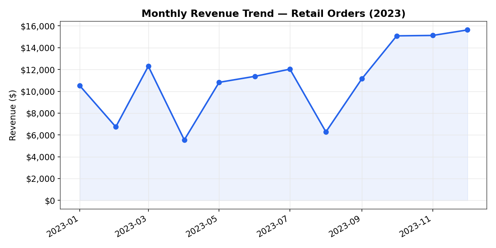

*Figure 1: Monthly revenue trend across 2023, with growth swinging from -54.9% (April) to +95.3% (May)*

- **Skills demonstrated:** CTEs, window functions (`LAG`), `ROLLUP`, joins, `FILTER`, aggregate functions
- **Key insight:** Revenue climbed from **$10.5K** in January to **$15.6K** by December, though monthly growth was volatile — swinging as much as ±80–95% month over month.

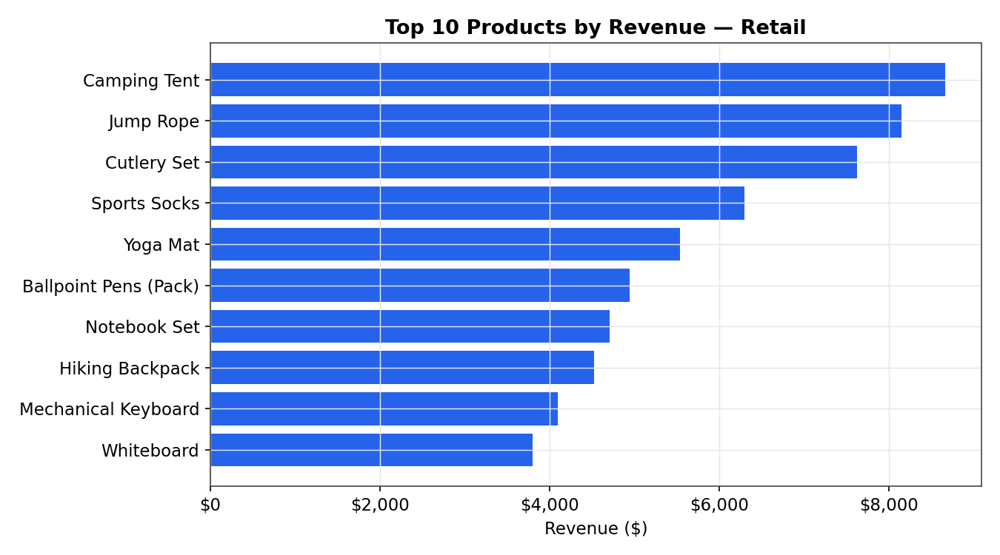

*Figure 2: Top 10 products by revenue*

| Metric | Value |
|---|---|
| Total revenue (completed orders) | **$132,595.70** |
| Total cost | **$70,593.74** |
| Total profit | **$62,001.96** |
| Overall profit margin | **46.76%** |
| Top product | **Camping Tent** — $8,657 revenue, 56% margin |
| Repeat customers (2+ orders) | **33** |
| Top repeat customer | James White — 6 orders, $7,036.30 spent |

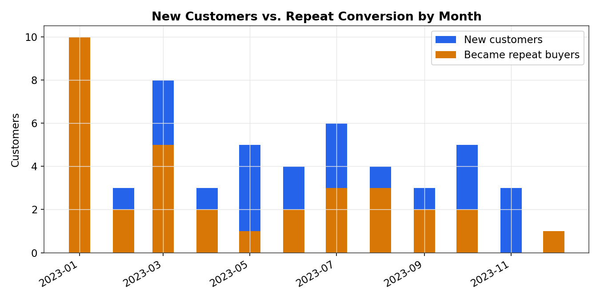

*Figure 3: New customer acquisition vs. conversion into repeat buyers, by month*

---

### 2. [Banking Fraud & Risk Monitoring](Project_2.sql)

**Summary:** Flags high-value and off-hours transactions, measures loan default rates by loan type, and builds a combined risk-scoring report across 1,560 transactions.

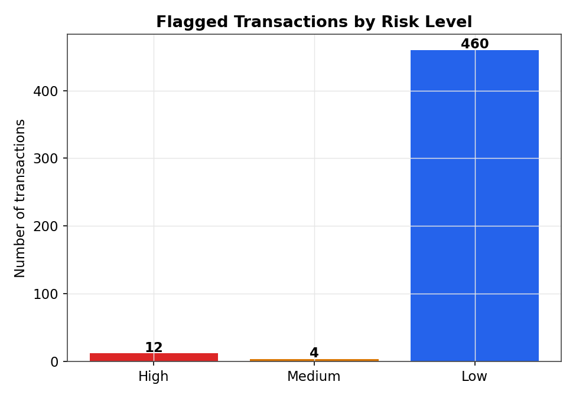

*Figure 4: Transactions flagged by the combined risk model (amount + timing + velocity signals)*

- **Skills demonstrated:** `CASE` risk scoring, window functions (`LAG` for time gaps), `EXTRACT`, `FILTER`, multi-table joins
- **Key insight:** Of 1,560 transactions, **12** were flagged High risk (mostly ≥$15,000 transfers) and **466 (29.9%)** occurred outside normal hours (11pm–6am).

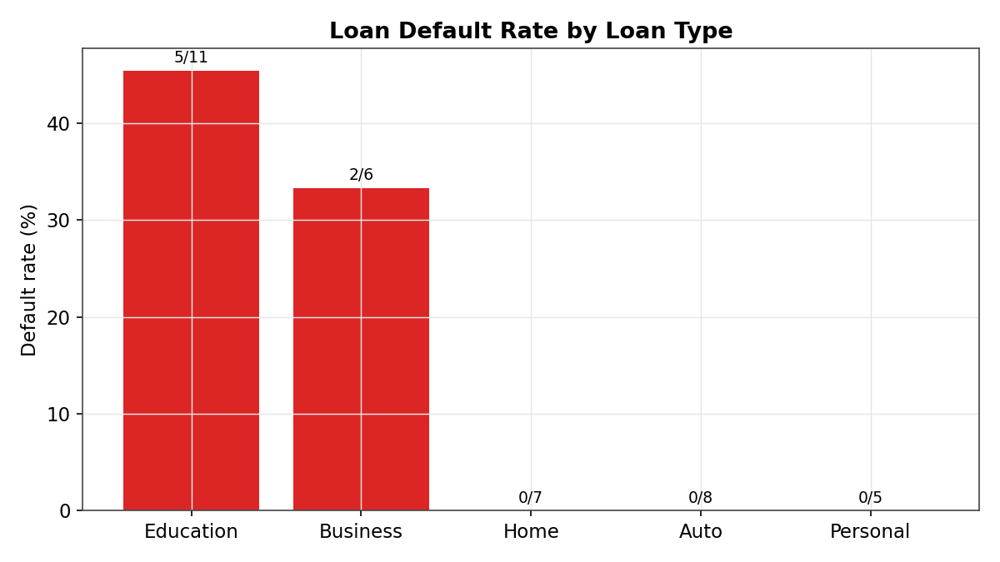

*Figure 5: Default rate by loan type — Education loans default far more often than secured loan types*

| Loan Type | Total Loans | Defaulted | Default Rate |
|---|---|---|---|
| Education | 11 | 5 | **45.45%** |
| Business | 6 | 2 | **33.33%** |
| Home | 7 | 0 | 0.00% |
| Auto | 8 | 0 | 0.00% |
| Personal | 5 | 0 | 0.00% |

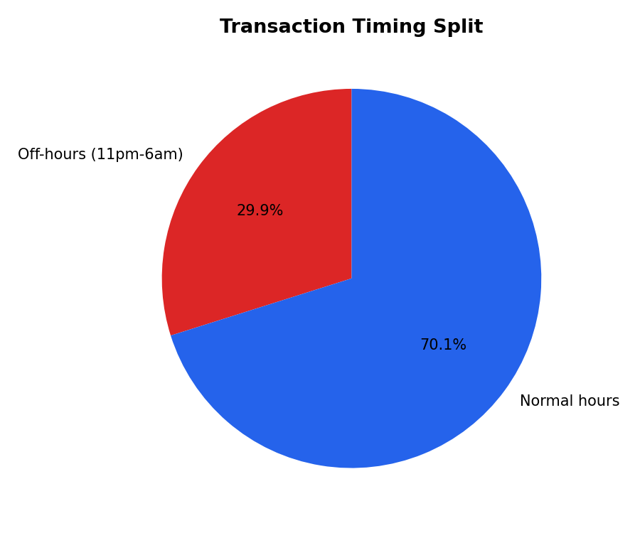

*Figure 6: Share of transactions occurring outside normal banking hours*

- **Additional finding:** 8 customers hold multiple active loans; the highest combined exposure is **$126,467.98** (Michelle Lee, 2 loans).

---

### 3. [E-Commerce Operations & KPI Dashboard](Project_3.sql)

**Summary:** Analyzes category profitability, cancellation/return rates, average order value, peak sales hours, site conversion, and delivery performance for a separate e-commerce dataset — rolled up into a single KPI dashboard query.

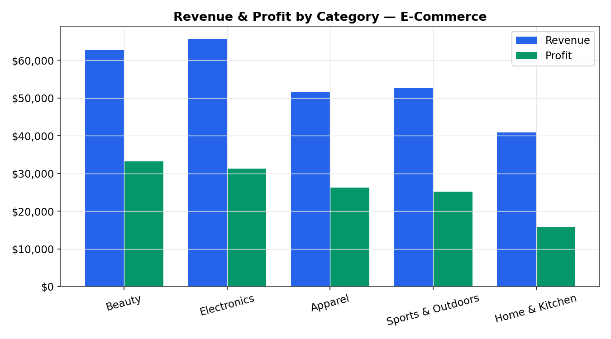

*Figure 7: Revenue and profit by product category — Beauty has the smallest revenue footprint but the highest margin (52.9%)*

| KPI | Value |
|---|---|
| Average Order Value | **$1,102.47** |
| Cancellation rate | **12.75%** |
| Conversion rate (site sessions) | **24.93%** |
| On-time delivery rate | **47.24%** |

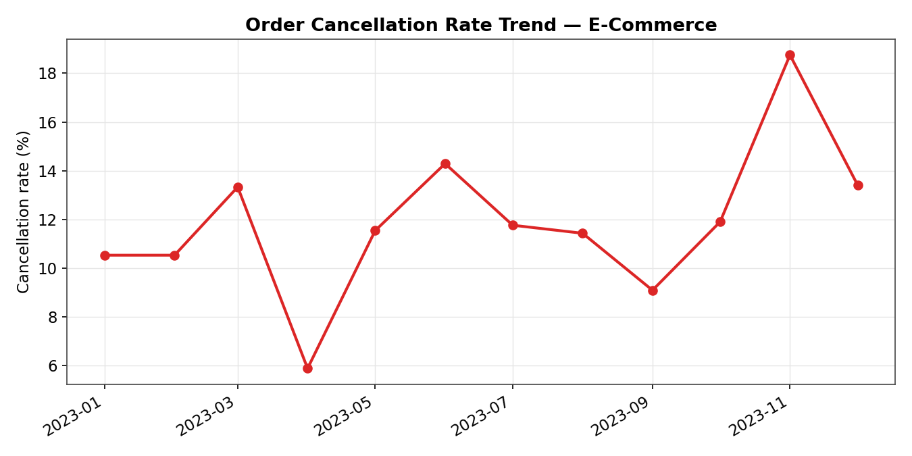

*Figure 8: Monthly cancellation rate — spikes to 18.75% in November*

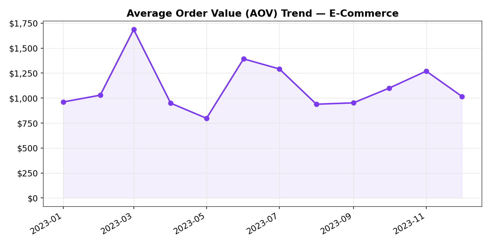

*Figure 9: Average order value trend, peaking at $1,686 in March*

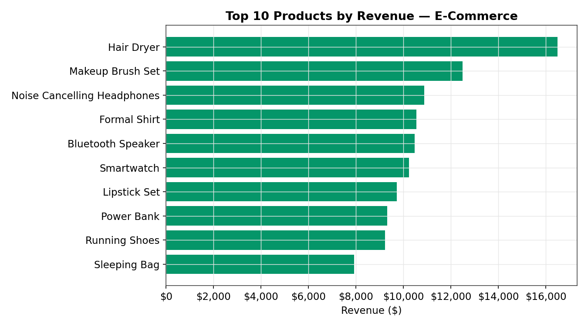

*Figure 10: Top 10 products by revenue — Hair Dryer leads at $16,494*

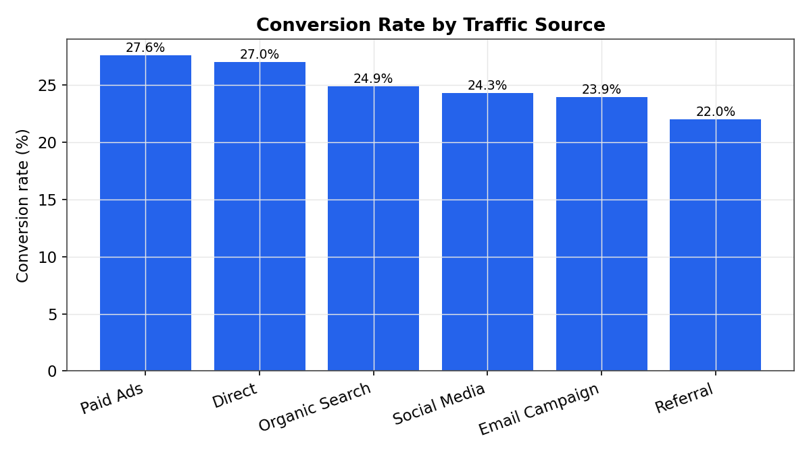

*Figure 11: Conversion rate by acquisition channel — Paid Ads (27.6%) converts best, Referral (22.0%) lags*

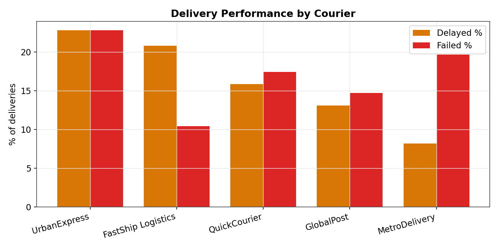

*Figure 12: Delayed vs. failed delivery rate by courier — UrbanExpress has the worst combined failure rate (45.6%)*

- **Skills demonstrated:** Multi-CTE KPI aggregation (`CROSS JOIN` of one-row CTEs), `FILTER`, `EXTRACT`, date-truncation, multi-table joins
- **Key insight:** Only 47.24% of deliveries arrive on time, and cancellation rate nearly doubled in November — both signal operational bottlenecks worth flagging to the business.

---

## 🗂️ Repository Structure

```
SQL_Internship/
├── README.md
├── LICENSE
├── Project_1.sql
├── Project_2.sql
├── Project_3.sql
├── Assets/ # Chart images referenced in this README
            # CSV exports of each query's output (used to build the charts)
├── accounts.csv
├── customers.csv
├── customers_e_commerce.csv
├── customers_fact.csv
├── deliveries_e_commerce.csv
├── loans.csv
├── order_items.csv
├── order_items_e_commerce.csv
├── orders.csv
├── orders_e_commerce.csv
├── payments.csv
├── products.csv
├── products_e_commerce.csv
├── transactions.csv
└── website_sessions_e_commerce.csv
```

---

## 🧰 Skills Summary

| Category | Skills |
|---|---|
| Querying | `SELECT`, joins, subqueries, CTEs, window functions (`LAG`) |
| Aggregation | `GROUP BY`, `ROLLUP`, `FILTER`, `HAVING` |
| Time analysis | `DATE_TRUNC`, `EXTRACT`, interval arithmetic |
| Risk/Fraud logic | Multi-signal `CASE` scoring, velocity checks |
| Tools | PostgreSQL / VSCode / Git / GitHub / Python (visualization) |

---

## 📌 How to Use This Repo

1. Clone the repo:

```
git clone https://github.com/Yuvan-BioCoder/SQL_Internship.git
```

2. Open any `.sql` file in your SQL client of choice (PostgreSQL recommended — queries use `FILTER`, `DATE_TRUNC`, and `ROLLUP`)
3. Load the accompanying `.csv` files as tables to run the queries against real data, or point the queries at your own schema

---

## 📄 License

This repository is licensed under the [MIT License](LICENSE).
